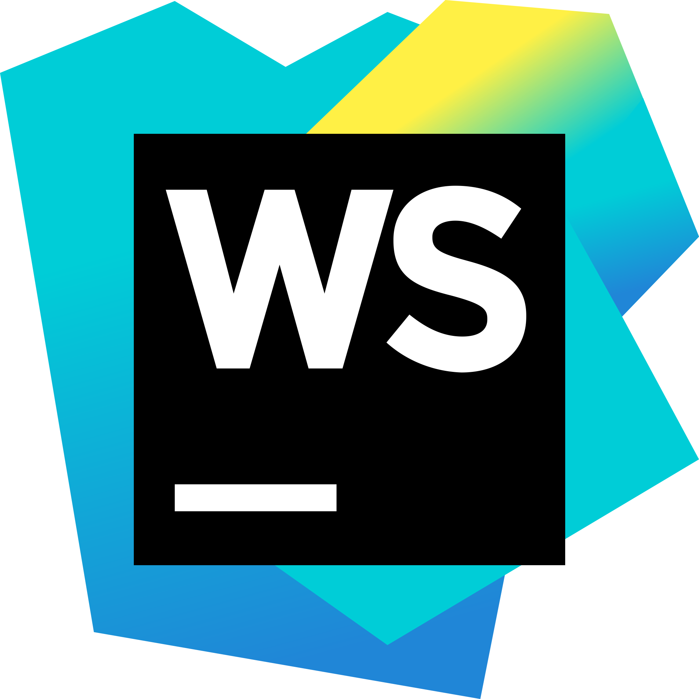

Hi 👋 My name is Max Kalugin
============================

I'm Java QA Automation Engineer
------------------

### About Me

Love code. Learning many things to become the best software developer in the world! Also like watch movies, TV shows, anime, play games, listen music, read books. I'm passionate about studying new features in Cloud and Network technologies.

- 🎓 **Education:** I have a bachelor's degree in "Operation of transport and technological machines and complexes"
- 💼 **Experience:** I have experience in Java automation testing about 1.5 years.
- 🚀 **Projects:** I'm working on several personal projects, including project with UI tests in Java.
- 🌱 **Goals:** My goal is to become a full-stack developer with expertise in cloud computing and network security.

## Tools I have used and learned

  
[//]: # (  Primary:)

|Git|Java|JavaScript|Python|
|:----------------------------------------------------------------------------------------------------------------------------------------------------------------------------------------------------------------------------:|:--------------------------------------------------------------------------------------------------------------------------------------------------------------------------------------------------------------------------------------:|:-----------------------------------------------------------------------------------------------------------------------------------------------------------------------------------------------------------------------------------------------------------------------------:|:-------------------------------------------------------------------------------------------------------------------------------------------------------------------------------------------------------------------------------------:|
|  |  |  |  

[//]: # (  Secondary:)

|Bash|HTML|CSS|Postgres|Docker|IndelliJ Idea|
|:----:|:----:|:----:|:----:|:----:|:----:|
|  |||||

[//]: # (  I am work a lot with:)

|Allure Report|Maven|Selenium|Postman|RestAssured|JMeter|Jenkins|WebStorm|Gitlab|
|:----:|:----:|:----:|:----:|:----:|:----:|:----:|:----:|:----:|
|  ||||||||
  

[//]: # (## Like be here)

[//]: # ()
[//]: # (    
)

## You can find me on

| BlueSky | Telegram | Gmail | Linkedin |
|:-------:|:--------:|:-----:|:--------:|
|||||

[//]: # (
)

[//]: # ()

[//]: # ()

[//]: # ()

[//]: # ()

[//]: # (
)

## Statistics

[//]: # (![]&#40;https://github-profile-summary-cards.vercel.app/api/cards/profile-details?username=MaxainNN-F&theme=merko&#41;)

[//]: # (![]&#40;https://github-profile-summary-cards.vercel.app/api/cards/profile-details?username=MaxainNN-Fo&theme=merko&#41;)

[//]: # (![]&#40;https://github-profile-summary-cards.vercel.app/api/cards/most-commit-language?username=MaxainNN-F&theme=merko&#41;)

[//]: # (![]&#40;https://github-profile-summary-cards.vercel.app/api/cards/repos-per-language?username=MaxainNN-F&theme=merko&#41;)

[//]: # (![]&#40;https://github-profile-summary-cards.vercel.app/api/cards/stats?username=MaxainNN-F&theme=merko&#41;)

[//]: # (![]&#40;https://github-profile-summary-cards.vercel.app/api/cards/productive-time?username=MaxainNN-F&theme=merko&#41;)

