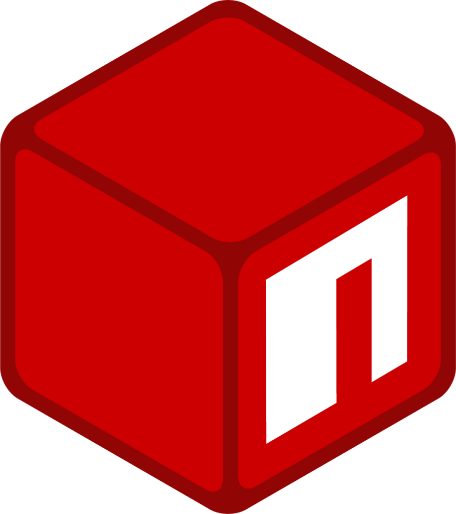

Hi 👋 My name is Max Kalugin
============================

I'm Java QA Automation Engineer
------------------

### About Me

Love code on Python and Java. Learning many things to become the decent QA Engineer! Also like watch movies, TV shows, anime, play games, listen music, read books. I'm passionate about studying new features in Cloud and Network technologies.

- 🎓 **Education:** I have a bachelor's degree in "Operation of transport and technological machines and complexes"
- 💼 **Experience:** I have experience in Java automation testing about 1.5 years.
- 🚀 **Projects:** I'm working on several personal projects, including project with UI tests basics in Java.
- 🌱 **Goals:** My goal is to become a full-stack QA Engineer with expertise in cloud computing and network security.

## Tools I have used and learned

  
|                                                                            Java                                                                             |                                                                     IntelliJ IDEA                                                                     |                                                                       Maven                                                                        |                                                                      Gradle                                                                       |                                                                    JUnit 5                                                                     |                                                                                  TestNG                                                                                   |                                                           Selenium                                                           |                                                            RestAssured                                                             |
|:-----------------------------------------------------------------------------------------------------------------------------------------------------------:|:-----------------------------------------------------------------------------------------------------------------------------------------------------:|:--------------------------------------------------------------------------------------------------------------------------------------------------:|:-------------------------------------------------------------------------------------------------------------------------------------------------:|:----------------------------------------------------------------------------------------------------------------------------------------------:|:-------------------------------------------------------------------------------------------------------------------------------------------------------------------------:|:----------------------------------------------------------------------------------------------------------------------------:|:----------------------------------------------------------------------------------------------------------------------------------:|
|  |  |  |  |  |    |  |  |

|                                                                       TypeScript                                                                       |                                                                          WebStorm                                                                          |                                                                        NPM                                                                        |                                                                            Playwright                                                                             |
:------------------------------------------------------------------------------------------------------------------------------------------------------:|:----------------------------------------------------------------------------------------------------------------------------------------------------------:|:-------------------------------------------------------------------------------------------------------------------------------------------------:|:-----------------------------------------------------------------------------------------------------------------------------------------------------------------:|
|         |  |  |  |

|                                                                      Python                                                                      |                                                                      PyCharm                                                                      |                                                                           Pytest                                                                           |
:------------------------------------------------------------------------------------------------------------------------------------------------:|:-------------------------------------------------------------------------------------------------------------------------------------------------:|:----------------------------------------------------------------------------------------------------------------------------------------------------------:|
|  |  |  |

|                                                                           Postman                                                                            |                                                                    Allure Report                                                                    |                                                                       JMeter                                                                       |                                                                        Jenkins                                                                         |                                                                      Gitlab                                                                      |                                                                       Postgres                                                                        |                                                                     Docker                                                                      |
:------------------------------------------------------------------------------------------------------------------------------------------------------------:|:---------------------------------------------------------------------------------------------------------------------------------------------------:|:--------------------------------------------------------------------------------------------------------------------------------------------------:|:------------------------------------------------------------------------------------------------------------------------------------------------------:|:------------------------------------------------------------------------------------------------------------------------------------------------:|:-----------------------------------------------------------------------------------------------------------------------------------------------------:|:-----------------------------------------------------------------------------------------------------------------------------------------------:|
|  |  |  |  |  |  |  |

|                                                                            Jira                                                                             |                                                                               Confluence                                                                                |
:-----------------------------------------------------------------------------------------------------------------------------------------------------------:|:-----------------------------------------------------------------------------------------------------------------------------------------------------------------------:|
|  |  |

## For good mood

|Spotify|Shikimori|
|:--:|:-----:|
||  |

## You can find me on

| BlueSky | Telegram | Gmail | Linkedin |
|:-------:|:--------:|:-----:|:--------:|
|||||

## Statistics

